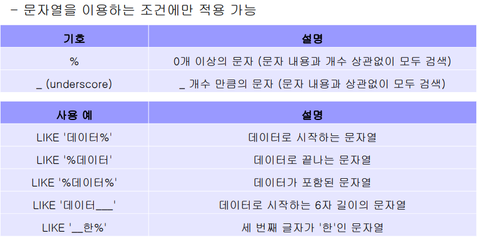

1. TABLE 만드는 법

   create table ! 

   

------------------------------------------

외래키 : 기본키가 존재해야 생김

CONSTRAINT 제약조건명

FOREIGN KEY (내가 사용할 명칭/ 속성 리스트 )  REFERENCES 테이블명(속성 리스트)

부서테이블 존재. 사원테이블 존재.

사원테이블은 사원들이 각각 어느 부서에 속했는지를 보여줌.

학교는 하나. 입학하는 학생 여러개. 기본, 주는 학교 ! 

일대다 관계에서 '일'이 기본이 된다.

인사부, 연구부, 홍보부 는 하나. 거에 소속된 사람들이 여럿. => 일대 다 . 

'다' 부분이 외래키를 갖는다. '일' 이 기본키 !

\# 기본키 삭제 시 NULL값 입력, 수정 시 같이 수정

 **FOREIGN KEY (소속부서) **REFERENCES 부서 (부서번호) ON DELETE SET NULL ON UPDATE CASCADE 

● 테이블 변경 : ALTER TABLE 

### ADD

### 외래키(제약조건) 추가

ALTER TABLE 테이블명

 ADD [CONSTRAINT 제약조건명] 

FOREIGN KEY(속성명) REFERENCES 참조테이블명(참조속성명);

### MODIFY

-------------

## DML

- INSERT

  - INSERT INTO 테이블명 

    [(속성 리스트)]  # 생략 가능 

    VALUES (속성의 값 리스트);

  - INSERT INTO 부서 (부서번호, 부서이름) VALUES (1, '인사부'); 

    INSERT INTO 부서 (부서번호, 부서이름) VALUES (2, '연구부'); 

    INSERT INTO 부서 (부서번호, 부서이름) VALUES (3, '홍보부');

- select
  - SELECT [DISTINCT] 속성 리스트 FROM 테이블 리스트
    - 예시 : SELECT 고객아이디, 고객이름, 등급
       FROM 고객;

-  조건에 해당하는 데이터 검색 : WHERE
  - SELECT [DISTINCT] 속성 리스트 FROM 테이블 리스트 **[WHERE 조건]**;

예시  : SELECT 제품명, 재고량, 단가 FROM 제품 WHERE 제조업체 = '한빛제과';

- 부분적으로 일치하는 데이터 검색  : LIKE

- 데이터 검색 후 정렬 : order by

  - SELECT [DISTINCT] 속성 리스트 FROM 테이블 [WHERE 조건] [ORDER BY 속성 리스트 [ASC | DESC]];

  - 예시  : SELECT 고객이름, 등급, 나이 FROM 고객 **ORDER BY 나이 DESC;**

  - 예시 : SELECT 주문고객, 주문제품, 수량, 주문일자 FROM 주문 

    WHERE 수량 >= 10 **ORDER BY 주문제품 ASC, 수량 DESC;**

-  limit 