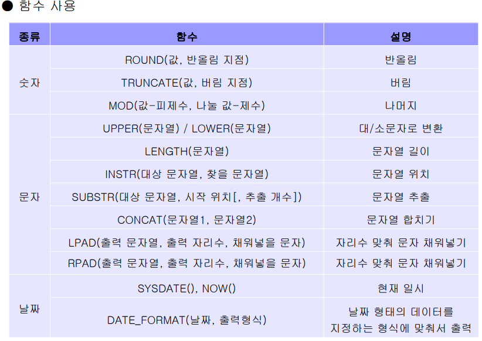
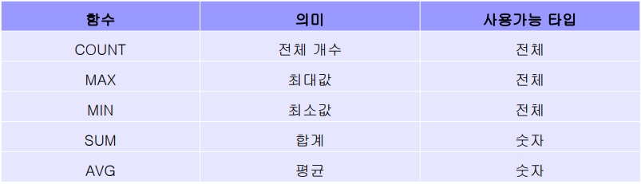
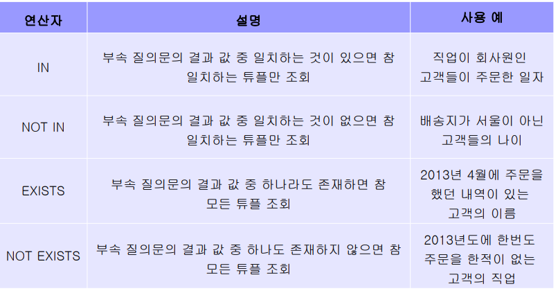

- SUBSTR

  `SELECT SUBSTR(HIREDATE, 1, 10) FROM EMP;`

- CONCAT

  SELECT * FROM EMP 
  WHERE ENAME LIKE '%A%';

  SELECT * FROM EMP 
  WHERE ENAME LIKE '%','A','%';

- NOW

- DATE_FORMAT 

  `SELECT DATE_FORMAT(NOW(), '%Y년 %m월 %d일 %H:%i:%s');`

  

- ROUND

- 예시 : ROUND(10.123, **2**) -> 뒤의 숫자는 소수점 기준

  만약에 -1 이면 1의 자리에서 올림한다. 

  `SELECT SAL * 0.5, ROUND(SAL*0.5, 0) FROM EMP;`

■ 데이터 조회 : SELECT 



● 집계 함수를 이용한 검색

- 통계적으로 계산한 결과를 검색 
-  개수, 합계, 평균, 최대, 최소값 계산 기능 제공
- **속성값이 NULL 인 경우 제외 **
  - 점수가 할당이 되어 있을 때, 3명에 대한 점수가 10점, 9점, NULL 일때, 원래는 19/3 이어야 하는데, NULL 을 무시해서 19/2 가 되어버림... 
  - 그러므로 **IFNULL** 함수를 잘 활용해야 한다. 
-  SELECT 절 또는 HAVING 절 에서만 사용 가능 (WHERE 절 사용 불가)


------

- GROUP BY :  분류 기준 

  -  '주문' 테이블에서 주문제품별 수량의 합계 검색

  - `SELECT 주문제품, SUM(수량) AS 총주문수량 FROM 주문 GROUP BY 주문제품;`

----------------------

## JOIN

#### 조인 : 여러 개의 테이블을 연결하여 하나의 테이블처럼 사용하는 것

- 연결하려는 도메인 이 같아야 함 !!! 같은 INT 여야 함. !!!!!

- 일반적으로 외래키가 조인 속성으로 사용된다.

  `SELECT 속성 FROM 테이블1, 테이블2 WHERE 테이블1.속성 = 테이블2.속성;`

  `SELECT 속성 FROM 테이블1 JOIN 테이블2 ON 테이블1.속성 = 테이블2.속성 JOIN 테이블3 ON 테이블1.속성 = 테이블3.속성;`

종류

- NON - EQUI 조인

  예 : EMP 테이블 . 

- SELF 조인

  예 : EMP  테이블 : 나의 사수 사원번호가 있음. 한개의 테이블 내에 참조해야할 데이터가 있으 ㄹ때. 자기가 자기와 조인해야 하기 때문.

- Outer 조인 ㆍ연결되는 컬럼 값이 없더라도 데이터를 검색해주는 조인


LEFT

있으면 보여주고, 없으면 NULL 값 나타냄. 

제품 왼쪽, 주문 오른쪽. 

------------------

## SUBQURERY



----------

## UPDATE (데이터 수정)

INSERT INTO 테이블 VALUES


SELECT * FROM 테이블

WHERE/ GROUP BY / ORDER BY

UPDATE 테이블 SET

DELETE FROM 테이블 

```mariadb
SELECT * FROM 제품;

UPDATE 제품 SET 제품명 = '통큰파이' WHERE 제품명 = '쿵떡파이; #WHERE 조건을 항상 열어야 한다 !!!! 
```

#※ DB 접속 툴 HeidiSQL 사용 시 Auto Commit 비활성화
** SET @@AUTOCOMMit = 0;*

