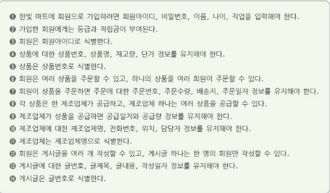
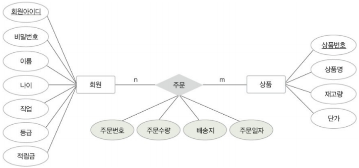
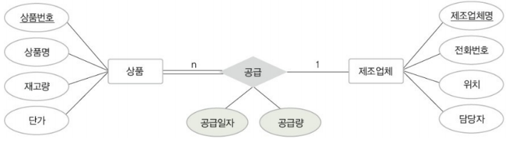
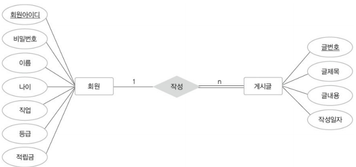
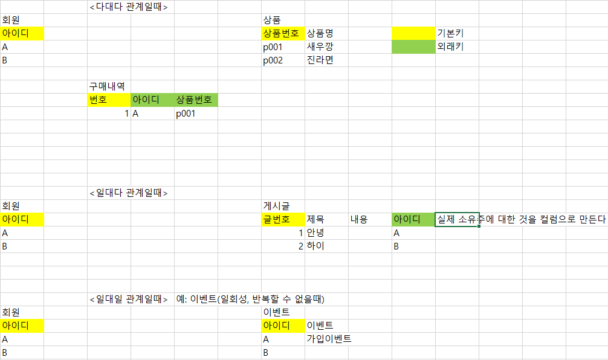
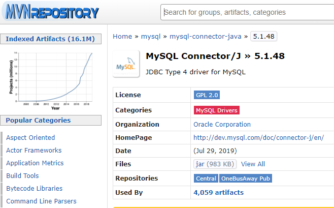
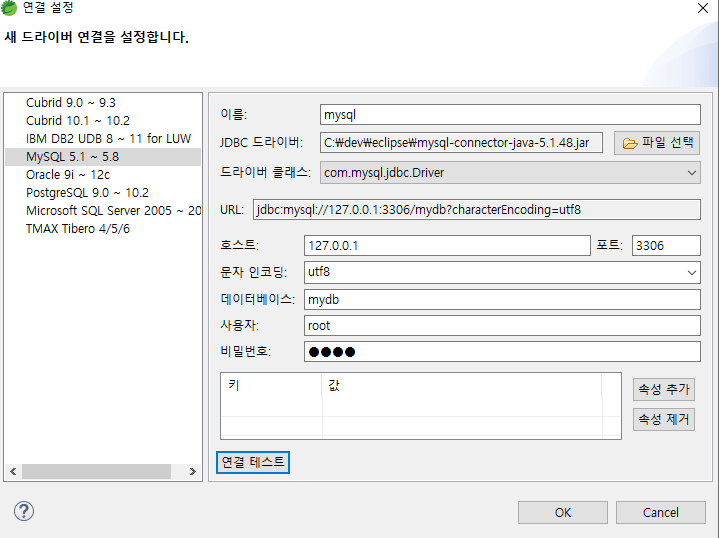
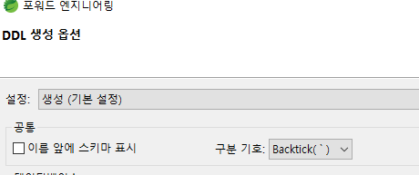
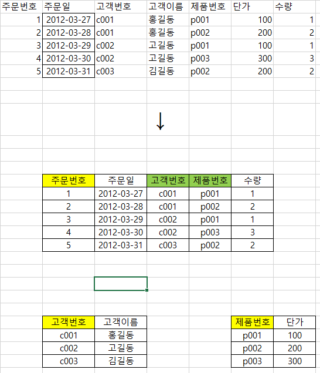

## 데이터베이스 설계

- 설계 과정

  

- 요구사항 분석 
  - 결과물 : 요구 사항 안내서 (회의록, 엑셀을 주로 많이 사용함)
  - 
- 개념적 설계 : 만약 게시판을 만든다. 게시판을 대충 설계해 본다.   
  - 개체 : 저장할만한 가치가 있는 중요 데이터를 가진 사람, 사물 등
  - 결과물 : 개념적 스키마(E-R 다이어그램)
  - 요구사항 중에서 각 개체에 관련한 속성과 키 속성에 관련한 키워드 단어들을 추출함  
    - 개체 : 상품 
    - 속성 : 상품번호, 상품명, 재고량, 단가 ㆍ
    - 키 속성 : 상품번호
  - 개체 간의 관계 결정
    -  관계 : 개체 간의 의미 있는 연관성
    - 요구 사항 중 개체 간의 연관성을 나타내는 동사를 잘 알아야함. 
    - 예 ;  추출 결과 
      - 관계 : 주문 회원과 상품이 맺는 관계 (다대다 n:m 관계) 
      - 주문 관계의 속성 : 주문번호, 주문수량, 배송지, 주문일자

상품도 여러 사람한테 팔릴 수 있고, ... 다대다 관계이다 ! 

제조업체는 상품을 많이 생산함. 일대다

회원 한명이 게시글 여러개 쓸 수 있음. 일대다 

- 논리적 설계 : 만약 회원가입 한다면, 회원의 어떤 정보를 가져가야할지 결정함. 

- 상대적으로 4,5 단계는 코더가 함. 

-----------------------------------------

(exerd 설치하기)

exerd 사이트에서 다운로드 ->이클립스 플러그인으로 설치 클릭, 주소 복사. 

eclips 혹은 sts  - help 메뉴 - install new software -> work with 에 주소 붙여넣기 http://exerd.com/update/3.x/ 엔터

-> contact all update 체크 해제

프로젝트 오른쪽 클릭 -> new -other-exerd file -> 대상 db - mysql 

----------

jar 983kb 클릭

window - preferences - exerd - dbms 연결 설정 - 이름:아무거나 - 파일선택 받은것 클릭 - 드라이버클래스 (com.mysql.jdbc.driver)

<포워드 엔지니어링>

 스키마 표시 끄기 

아까 만들어둔 mysql 로 가면 DDL 할 수 있음 ! 

--------------

### 관계형 db란

중복되는 것이 없게 원 테이블을 쪼개서 다시 합친다.

